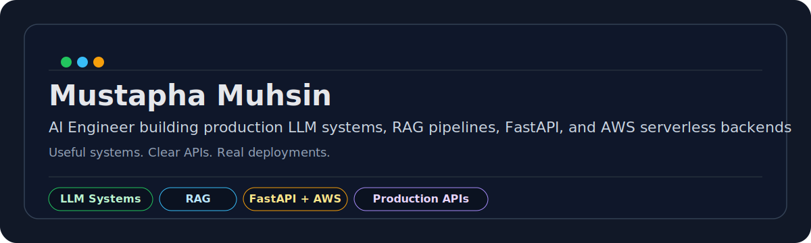

  

<h2 align="center">Mustapha Muhsin</h2>

  AI Engineer focused on production LLM systems, RAG pipelines, FastAPI, and AWS serverless backends 
  <a href="https://linkedin.com/in/mustapha-muhsin-2288bb33b">LinkedIn</a> &nbsp;·&nbsp;
  <a href="mailto:onoruoiza15@gmail.com">onoruoiza15@gmail.com</a>

  I like building useful AI systems that ship.

---

### What I build
- Production LLM and RAG systems
- FastAPI and Python backend services
- AWS serverless applications with reliable workflows
- Autonomous tooling that helps teams move faster

### Why it matters
I care about systems that can be shipped, maintained, and trusted by real teams. My work usually sits at the point where AI, backend engineering, and cloud operations meet.

### Proof
- [rag-chatbot-api](https://github.com/muhsin9999/rag-chatbot-api) - production RAG API with Pinecone, FastAPI, Celery, Redis, S3, and PostgreSQL
- [AttendanceAPI](https://github.com/muhsin9999/AttendanceAPI) - facial recognition attendance API with dlib, OpenCV, PostgreSQL, and JWT auth
- [task-manager-api](https://github.com/muhsin9999/task-manager-api) - cloud-native REST API with Docker, PostgreSQL, and GitHub Actions CI/CD

### Current focus
- AI article generation and SEO tooling at White Label Resell
- Production AWS systems and internal tooling
- Multi-agent automation, orchestration, and code improvement workflows
- Clear engineering habits: readable APIs, reliable deployments, and systems teams can maintain
